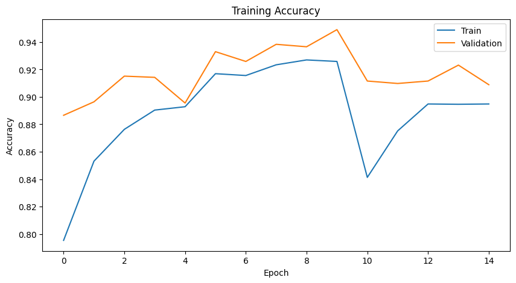

# Brain Tumor Detection using Deep Learning

A comprehensive deep learning project for detecting and classifying brain tumors from MRI images using EfficientNetB0 architecture with transfer learning.



## 📋 Table of Contents

* [Overview](#overview)
* [Project Features](#project-features)
* [Dataset](#dataset)
* [Model Architecture](#model-architecture)
* [Installation](#installation)
* [Usage](#usage)
* [Results](#results)
* [File Structure](#file-structure)
* [Requirements](#requirements)
* [Contributing](#contributing)
* [License](#license)

---

## 🎯 Overview

This project implements a state-of-the-art deep learning model for automated brain tumor detection and classification from MRI images. The model leverages transfer learning with EfficientNetB0, a highly efficient and accurate convolutional neural network architecture, to achieve high accuracy while maintaining computational efficiency.

### Key Objectives

* Detect the presence of brain tumors in MRI scans
* Classify tumors into multiple categories
* Provide a user-friendly inference pipeline
* Achieve high accuracy with minimal computational overhead

---

## ✨ Project Features

* **Transfer Learning**: Utilizes pre-trained EfficientNetB0 model for faster and more accurate training
* **Data Augmentation**: Implements comprehensive data augmentation strategies for improved generalization
* **Model Optimization**: Includes normalization and rescaling layers for optimal model performance
* **Jupyter Notebooks**: Complete training and prediction pipelines in easy-to-follow notebooks
* **Pre-trained Model**: Includes a production-ready Keras model (`brain_tumor_final.keras`)
* **Visualization**: Sample MRI images and output predictions for reference

---

## 📊 Dataset

The project uses brain MRI images for tumor detection and classification.

### Dataset Characteristics

* MRI scans with and without tumors
* Image format: JPG / PNG
* Images resized to **224×224**
* Pixel values normalized to **[0,1]**
* Data augmentation applied during training

### Classes

* No Tumor (Healthy Brain)
* Tumor Present

> **Note:** The dataset is not included in this repository due to size and licensing restrictions.

---

## 🧠 Model Architecture

The model is built on **EfficientNetB0** with transfer learning.

```text
Input Layer (224x224x3)
        ↓
Rescaling Layer
        ↓
Normalization Layer
        ↓
EfficientNetB0 (ImageNet Weights)
        ↓
Global Average Pooling
        ↓
Dense + Dropout Layers
        ↓
Softmax Output Layer
```

### Model Specifications

| Parameter           | Value              |
| ------------------- | ------------------ |
| Base Model          | EfficientNetB0     |
| Input Shape         | (224, 224, 3)      |
| Pre-trained Weights | ImageNet           |
| Parameters          | ~5.3 Million       |
| Framework           | TensorFlow / Keras |

---

## 🚀 Installation

### Prerequisites

* Python 3.8+
* pip
* CUDA 11.x (optional for GPU acceleration)

### Clone Repository

```bash
git clone https://github.com/Ash-Misty/AIML-Projects.git
cd AIML-Projects/brain_tumor
```

### Create Virtual Environment

```bash
python -m venv venv
```

#### Windows

```bash
venv\Scripts\activate
```

#### Linux / macOS

```bash
source venv/bin/activate
```

### Install Dependencies

```bash
pip install -r requirements.txt
```

Or manually:

```bash
pip install tensorflow keras numpy pandas matplotlib scikit-learn pillow opencv-python
```

---

## 📖 Usage

### Training the Model

Launch Jupyter Notebook:

```bash
jupyter notebook train.ipynb
```

Follow the notebook workflow:

1. Load dataset
2. Preprocess images
3. Apply data augmentation
4. Build EfficientNetB0 model
5. Train model
6. Evaluate performance
7. Save trained model

---

### Making Predictions

Launch:

```bash
jupyter notebook predict.ipynb
```

Prediction workflow:

1. Load trained model
2. Load MRI image
3. Preprocess image
4. Run inference
5. Display prediction results

---

### Quick Prediction Example

```python
import tensorflow as tf
from PIL import Image
import numpy as np

# Load model
model = tf.keras.models.load_model("brain_tumor_final.keras")

# Load image
img = Image.open("sample.jpg").resize((224, 224))

# Preprocess
img_array = np.array(img) / 255.0
img_array = np.expand_dims(img_array, axis=0)

# Predict
predictions = model.predict(img_array)

predicted_class = np.argmax(predictions[0])
confidence = predictions[0][predicted_class]

print(f"Prediction: Class {predicted_class}")
print(f"Confidence: {confidence:.2%}")
```

---

## 📈 Results

### Performance Highlights

* High training accuracy
* Strong validation performance
* Fast CPU and GPU inference
* Lightweight deployment model (~96 MB)

### Evaluation Metrics

* Accuracy
* Precision
* Recall
* ROC-AUC Score
* Confusion Matrix Analysis

Sample predictions can be found in **output.png**.

---

## 📁 File Structure

```text
brain_tumor/
│
├── README.md
├── train.ipynb
├── predict.ipynb
├── brain_tumor_final.keras
├── sample.jpg
├── output.png
├── requirements.txt
├── .gitignore
│
└── data/
    ├── train/
    ├── val/
    └── test/
```

---

## 📦 Requirements

```text
tensorflow>=2.11.0
keras>=2.11.0
numpy>=1.21.0
pandas>=1.3.0
matplotlib>=3.4.0
scikit-learn>=0.24.0
Pillow>=8.0.0
opencv-python>=4.5.0
jupyterlab>=3.0.0
```

---

## 🔬 Technical Details

### Data Preprocessing

* Resize images to **224×224**
* Normalize pixel values to **[0,1]**
* Feature standardization

### Data Augmentation

* Random rotation
* Horizontal flipping
* Vertical flipping
* Zoom transformations
* Width and height shifts
* Brightness adjustment

### Training Configuration

| Setting           | Value                    |
| ----------------- | ------------------------ |
| Optimizer         | Adam                     |
| Loss Function     | Categorical Crossentropy |
| Learning Rate     | Adaptive Scheduling      |
| Early Stopping    | Enabled                  |
| Model Checkpoint  | Enabled                  |
| ReduceLROnPlateau | Enabled                  |

---

## 💡 Key Insights

* Transfer learning significantly improves convergence speed.
* EfficientNetB0 provides an excellent balance between accuracy and computational efficiency.
* Data augmentation improves robustness and generalization.
* Class imbalance should be addressed using weighted loss functions if necessary.

---

## 🛠️ Troubleshooting

### GPU Memory Issues

```python
import tensorflow as tf

gpus = tf.config.list_physical_devices("GPU")

for gpu in gpus:
    tf.config.experimental.set_memory_growth(gpu, True)
```

### Model Loading Issues

```python
import tensorflow as tf

model = tf.keras.models.load_model(
    "brain_tumor_final.keras",
    custom_objects={"KerasLayer": tf.keras.layers.Layer}
)
```

---

## 🚀 Future Enhancements

* [ ] Multi-class tumor classification
* [ ] Ensemble learning methods
* [ ] 3D CNN support
* [ ] Attention mechanisms
* [ ] REST API deployment
* [ ] Web application interface
* [ ] DICOM image support

---

## 📚 References

1. EfficientNet: Rethinking Model Scaling for Convolutional Neural Networks
2. TensorFlow Documentation
3. Transfer Learning for Medical Imaging Applications

---

## 🤝 Contributing

Contributions are welcome.

1. Fork the repository
2. Create a feature branch
3. Commit changes
4. Push your branch
5. Open a Pull Request

---


## 👤 Author

**Ash-Misty**

* GitHub: https://github.com/Ash-Misty
* Repository: https://github.com/Ash-Misty/AIML-Projects

⭐ If you found this project useful, consider giving the repository a star.
