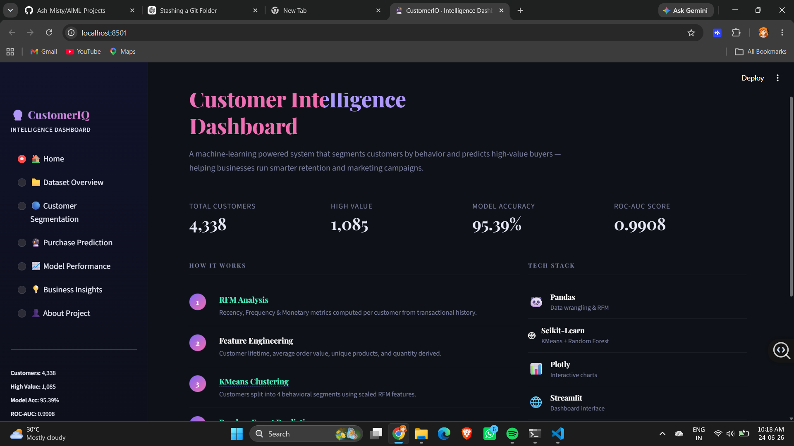
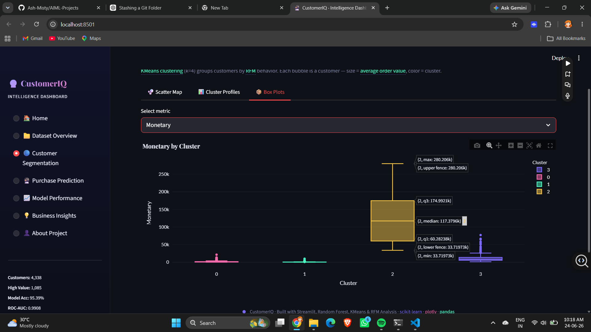
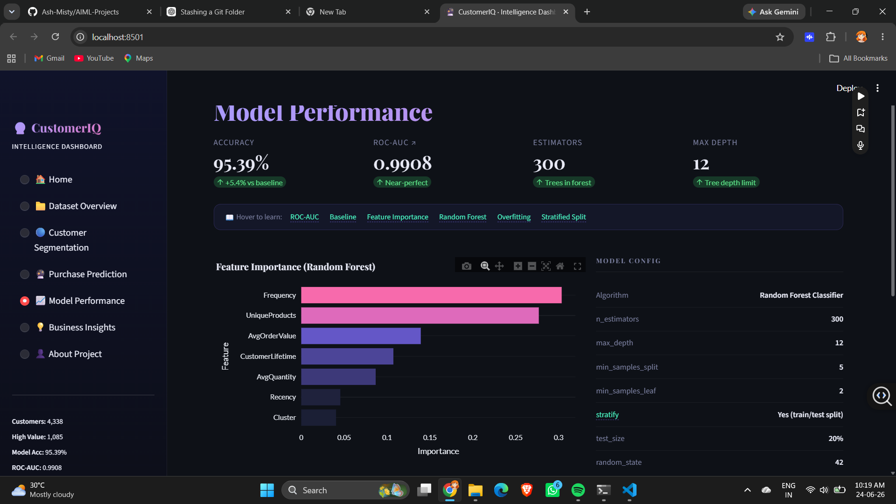
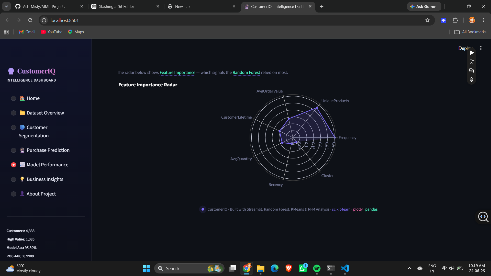

# CustomerIQ · Customer Segmentation & Value Prediction






A professional Streamlit dashboard for customer analysis, segmentation, and high-value customer prediction using RFM analysis, KMeans clustering, and a Random Forest classifier.

## Overview

This project turns raw transactional customer data into actionable business intelligence. It combines behavioral segmentation with supervised machine learning to help identify valuable customers, understand customer groups, and support targeted marketing decisions.

The application is built around an interactive Streamlit dashboard with multiple sections:

- **Home** – project summary and workflow
- **Dataset Overview** – preview, statistics, and distributions
- **Customer Segmentation** – KMeans clusters and cluster profiles
- **Purchase Prediction** – predicts whether a customer is high value
- **Model Performance** – evaluation metrics and feature importance
- **Business Insights** – practical actions for different customer segments
- **About Project** – end-to-end methodology and problem statement

## Business Problem

Many businesses treat all customers the same, even though a small portion of customers often generates a disproportionate share of revenue. This project helps solve that problem by:

1. Identifying customer behavior patterns
2. Segmenting customers into meaningful groups
3. Predicting whether a customer is likely to be high value
4. Translating model output into business actions

## Dataset

The project is based on customer transaction data that has been transformed into an RFM-style customer table. The cleaned dataset includes features such as:

- **Recency** – days since last purchase
- **CustomerLifetime** – days between first and last purchase
- **Frequency** – number of unique orders
- **Monetary** – total spend
- **AvgOrderValue** – average spend per order
- **AvgQuantity** – average quantity per order
- **UniqueProducts** – number of distinct products purchased
- **Cluster** – KMeans segment assignment
- **HighValueCustomer** – target label used for classification

## Features

### Interactive customer analytics dashboard
- Clean, polished UI with responsive Streamlit styling
- Multiple tabs/pages for exploration and decision-making
- Charts built with Plotly

### Customer segmentation
- KMeans clustering on customer behavior
- Cluster summaries and scatter visualizations
- Box plots for comparing segments across key metrics

### High-value customer prediction
- Random Forest model for binary classification
- Probability score and prediction output
- Input form for testing custom customer profiles

### Model interpretation
- Feature importance ranking
- Radar chart for model signal comparison
- Performance metrics displayed clearly for business stakeholders

### Business recommendations
- Segment-specific marketing suggestions
- Actionable guidance for retention and re-engagement campaigns

## Methodology

1. **Data cleaning**
   - Removed invalid or incomplete transaction records
   - Built a customer-level analysis table

2. **Feature engineering**
   - Created behavioral and value-based features
   - Computed RFM-style metrics and additional derived features

3. **Customer segmentation**
   - Applied KMeans clustering with 4 clusters
   - Used scaled behavioral features to group customers

4. **Target creation**
   - Defined high-value customers using the top 25% by Monetary value

5. **Model training**
   - Trained a Random Forest classifier
   - Used a stratified train/test split
   - Tuned model configuration for strong generalization

6. **Evaluation**
   - Accuracy: **95.39%**
   - ROC-AUC: **0.9908**

## Key Model Drivers

According to the stored feature importance file, the strongest signals are:

1. **Frequency**
2. **UniqueProducts**
3. **AvgOrderValue**
4. **CustomerLifetime**
5. **AvgQuantity**
6. **Recency**
7. **Cluster**

## Screenshots

These screenshots highlight the main areas of the dashboard:

- **Dashboard overview** – project landing page and workflow summary
- **Customer segmentation** – cluster behavior and box plot analysis
- **Model performance** – evaluation metrics and feature importance bars
- **Feature importance radar** – model signal comparison by feature

## Repository Structure

```text
customer analysis/
├── app.py
├── feature_importance.csv
├── rfm_data.csv
└── model.pkl


## How to Run

### 1. Clone the Repository

```bash
git clone https://github.com/Ash-Misty/AIML-Projects.git
cd AIML-Projects
```

### 2. Navigate to the Project Folder

```bash
cd "customer analysis"
```

### 3. Install Dependencies

```bash
pip install streamlit pandas plotly scikit-learn
```

### 4. Run the Application

```bash
streamlit run app.py
```

---

# Usage Guide

## Dataset Overview

Explore the cleaned dataset, summary statistics, and feature distributions.

## Customer Segmentation

View how customers are distributed across clusters and compare segment behavior.

## Purchase Prediction

Enter customer details to predict whether the customer is likely to be a high-value customer.

## Model Performance

Review model accuracy, ROC-AUC score, and feature importance.

## Business Insights

Use customer segment insights to design targeted retention and marketing strategies.

---

# Example Business Use Cases

- Build VIP loyalty campaigns for high-value customers.
- Trigger win-back campaigns for at-risk customers.
- Offer discounts or bundles to price-sensitive buyers.
- Improve onboarding strategies for one-time buyers.

---

# Notes

- The application expects the following files to be present in the same directory as `app.py`:
  - `model.pkl`
  - `rfm_data.csv`
  - `feature_importance.csv`
- The dashboard is optimized for storytelling and stakeholder presentations.
- Model predictions and insights are intended for analytical and educational purposes.

---

# Technologies Used

- Python
- Streamlit
- Pandas
- Plotly
- scikit-learn
- K-Means Clustering
- Random Forest