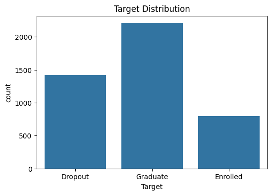
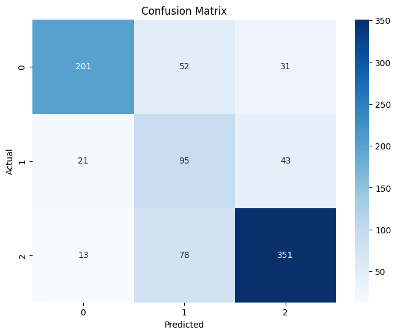
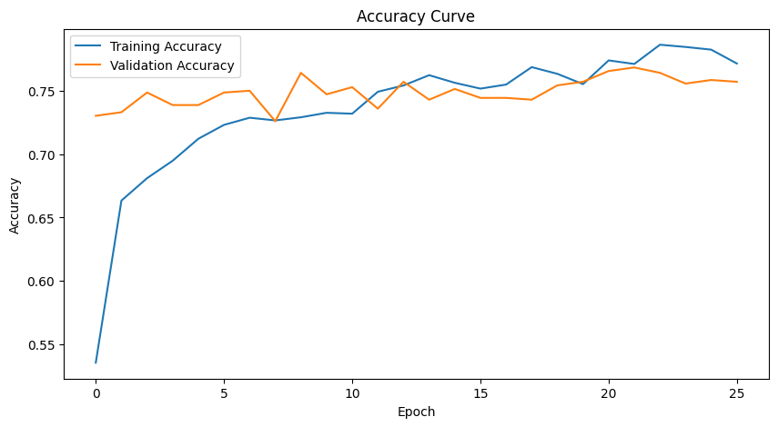
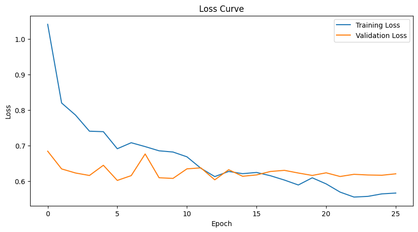

# Student Dropout Prediction

A teaching-focused project that analyzes student data and builds models to predict which students are at risk of dropping out. This directory includes a reproducible Jupyter notebook, supporting images, and a requirements file — suitable for classroom exercises or hands-on assignments.

---

## Contents

- `index.ipynb` — Main Jupyter notebook (EDA, preprocessing, modeling, evaluation)  
- `requirements.txt` — Python packages needed to run the notebook  
- `data/` — Datasets used by the notebook (may be omitted if large)  
- `img1.png`, `img2.png`, `img3.png`, `img4.png` — Visualizations produced during the analysis

---

## Project overview

The objective is to explore student attributes and train models that predict dropout. The notebook demonstrates a standard ML workflow:

1. Data loading & validation  
2. Exploratory Data Analysis (EDA) and visualizations  
3. Data cleaning and preprocessing (encoding, imputing, scaling)  
4. Feature engineering and selection  
5. Model training and hyperparameter tuning (e.g., Logistic Regression, Random Forest, XGBoost)  
6. Evaluation (confusion matrix, ROC/PR curves, precision, recall, F1) and interpretation (feature importance / SHAP)

---

## Quick start

1. Clone the repository and change into the project folder:

   ```bash
   git clone https://github.com/Ash-Misty/AIML-Projects.git
   cd AIML-Projects/student_dropout
   ```

2. (Optional) Create and activate a virtual environment:

   ```bash
   python -m venv .venv
   # macOS / Linux
   source .venv/bin/activate
   # Windows (PowerShell)
   .\.venv\Scripts\Activate.ps1
   ```

3. Install dependencies:

   ```bash
   pip install -r requirements.txt
   ```

4. Launch the notebook:

   ```bash
   jupyter notebook index.ipynb
   # or
   jupyter lab
   ```

Run the notebook cells in order for a reproducible analysis.

---

## Notebook structure

- Introduction & problem statement  
- Data loading and initial checks  
- EDA (distributions, class balance, correlations)  
- Data cleaning & preprocessing (categorical encoding, missing values, scaling)  
- Feature engineering & selection  
- Model pipelines, training & tuning  
- Evaluation, interpretation, and recommended next steps

---

## Key figures

Below are the main figures created by the notebook. Open `index.ipynb` to see the code that generated each image.

### Exploratory visualizations

  
*Figure 1: Distribution or relationship plots used during exploratory analysis.*

  
*Figure 2: Class balance, correlation heatmap, or other EDA visualization.*

### Model evaluation & interpretation

  
*Figure 3: Model evaluation (ROC or Precision-Recall curve).*

  
*Figure 4: Feature importance or SHAP summary showing top predictors of dropout.*

---

## Results summary (example)

- Baseline model (Logistic Regression) — accuracy: ~XX%, recall: ~XX%  
- Best model (e.g., XGBoost) — ROC-AUC: ~XX, precision/recall improvements over baseline  
- Most important features: attendance, grades, engagement, socioeconomic indicators (see SHAP plot)

(Replace the XX values with the actual metrics from running the notebook.)

---

## Reproducibility notes

- The notebook sets random seeds for reproducible experiments; however, exact results may vary by environment or package versions.  
- Use `requirements.txt` to match package versions used for development.  
- For large datasets, consider sampling or running on a machine with more memory.  
- Save trained models with joblib/pickle if you want to reuse them without retraining.

---

## Suggested exercises (for students)

- Try multiple classifiers and compare metrics (Logistic Regression, Random Forest, XGBoost, SVM).  
- Add feature engineering (interaction terms, binning, aggregated features).  
- Implement cross-validation and hyperparameter search (GridSearchCV / RandomizedSearchCV).  
- Produce calibration plots and analyze subgroup fairness/performance.

---

## License & credit

This project is intended for educational use. Please credit the author when reusing substantial parts of the notebook or code.

---

## Contact

For questions or suggestions, open an issue on the repository or contact the owner: https://github.com/Ash-Misty